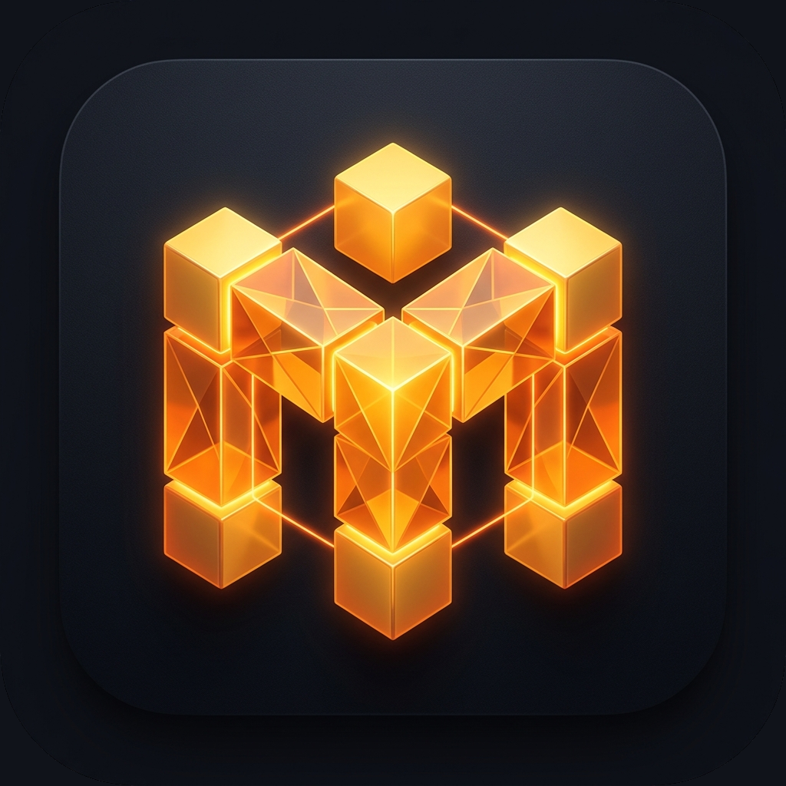

<div align="center">
  
  <h1>MOSAIC • Enterprise Micro-Frontend Platform</h1>

  <p>
    <strong>Production-grade, enterprise-scale Micro-Frontend Platform engineered with React, Vite Module Federation, and Asynchronous Decoupled PubSub State Architecture.</strong>
  </p>

  <p>
    <a href="https://reactjs.org/"></a>
    <a href="https://vitejs.dev/"></a>
    <a href="https://github.com/originjs/vite-plugin-federation"></a>
    <a href="#-architecture-overview"></a>
    <a href="LICENSE"></a>
  </p>
</div>

Every business domain (Auth, Dashboard, Users, Analytics, Notifications) is built, tested, and deployable as an **independent web application** on its own port, while dynamically orchestrating into a unified, ultra-responsive host shell at runtime with zero page reloads.

---

## 📑 Table of Contents

1. [Executive Summary](#-executive-summary)
2. [Architecture Overview](#-architecture-overview)
3. [Federated Modules & Ports](#-federated-modules--ports)
4. [Monorepo Project Structure & Architectural Layers](#-monorepo-project-structure--architectural-layers)
5. [Core Architectural Pillars](#-core-architectural-pillars)
   - [1. True Module Federation (Native ESM)](#1-true-module-federation-native-esm)
   - [2. Asynchronous PubSub Communication (`shared-bus`)](#2-asynchronous-pubsub-communication-shared-bus)
   - [3. Fault Tolerance & Outage Isolation (`ModuleErrorBoundary`)](#3-fault-tolerance--outage-isolation-moduleerrorboundary)
   - [4. Enterprise RBAC & Auth Session Engine](#4-enterprise-rbac--auth-session-engine)
   - [5. Design System & Micro-Animation Suite (`shared-ui`)](#5-design-system--micro-animation-suite-shared-ui)
6. [Deep Dive: Micro-Frontend Modules](#-deep-dive-micro-frontend-modules)
   - [Host Shell (`@mfe/host` :5000)](#1-host-shell-mfehost--port-5000)
   - [Auth Remote (`@mfe/auth` :5001)](#2-auth-gateway-mfeauth--port-5001)
   - [Dashboard Remote (`@mfe/dashboard` :5002)](#3-telemetry--kpi-dashboard-mfedashboard--port-5002)
   - [User Management Remote (`@mfe/users` :5003)](#4-user-management-mfeusers--port-5003)
   - [Analytics Engine Remote (`@mfe/analytics` :5004)](#5-analytics-engine-mfeanalytics--port-5004)
   - [Notifications Remote (`@mfe/notifications` :5005)](#6-notifications--incident-center-mfenotifications--port-5005)
   - [Shared UI System (`@mfe/shared-ui`)](#7-design-system--tokens-mfeshared-ui)
   - [Shared Bus & State (`@mfe/shared-bus`)](#8-pubsub-event-bus--state-mfeshared-bus)
7. [Getting Started & Development Workflow](#-getting-started--development-workflow)
8. [Production Deployment & Federation Verification](#-production-deployment--federation-verification)
9. [Chaos & Fault-Tolerance Testing](#-chaos--fault-tolerance-testing)
10. [FAQ & Troubleshooting](#-faq--troubleshooting)

---

## 🎯 Executive Summary

Modern enterprise frontends often evolve into fragile monolithic codebases where multi-team collaboration introduces deployment bottlenecks, tight coupling, and cascading failures.

**MOSAIC** solves these architectural challenges through strict domain-driven decentralization:

- **Autonomous Team Velocity**: Team Users can develop, test, and release the user management module independently without rebuilding the host or waiting on other teams.
- **Zero Library Bloat**: High-frequency dependencies (`react`, `react-dom`, `react-router-dom`) are declared as shared singletons across federation manifests, preventing multiple library downloads.
- **Fault-Tolerant Resilience**: If the Analytics or Notifications service crashes or encounters network latency, the rest of the application remains 100% functional with local error containment and retry capabilities.
- **Event-Driven Decoupling**: Business domains communicate exclusively via typed PubSub topics, eliminating direct code or memory dependencies between federated remotes.

---

## 🏛 Architecture Overview

```
                                  +-----------------------------+
                                  |      Host Shell (Platform)  |
                                  |    Port 5000 (Orchestrator) |
                                  |  - Dynamic Remote Loader    |
                                  |  - Route Guards & Spotlight |
                                  |  - Collapsible Sidebar      |
                                  |  - Theme Engine & Nav Bar   |
                                  +--------------+--------------+
                                                 |
                     +---------------------------+---------------------------+
                     |              |            |            |              |
                     v              v            v            v              v
               +-----------+  +-----------+ +---------+ +-----------+ +-------------+
               |   Auth    |  | Dashboard | |  Users  | | Analytics | |Notification |
               |  Remote   |  |  Remote   | | Remote  | |  Remote   | |   Remote    |
               | Port 5001 |  | Port 5002 | |Port 5003| | Port 5004 | |  Port 5005  |
               +-----------+  +-----------+ +---------+ +-----------+ +-------------+
                     |              |            |            |              |
                     +--------------+------------+------------+--------------+
                                                 |
                           +---------------------+---------------------+
                           |                                           |
                           v                                           v
                +----------------------+                   +----------------------+
                |  packages/shared-ui  |                   | packages/shared-bus  |
                |  - Design Tokens     |                   |  - PubSub Event Bus  |
                |  - Card, Button, UI  |                   |  - Auth Session Store|
                |  - Modal & Skeleton  |                   |  - Mesh Chaos Engine |
                |  - CSS Animations    |                   |  - Mock Enterprise DB|
                +----------------------+                   +----------------------+
```

---

## 🔌 Federated Modules & Ports

| Package / Module | Role | Dev Port | Technology | Federation Exposes |
| :--- | :--- | :---: | :--- | :--- |
| **`@mfe/host`** | Platform Shell / Root | **`5000`** | React 18, Vite 6, React Router 6 | Consumes all remotes (`auth`, `dash`, `users`, `analy`, `notif`) |
| **`@mfe/auth`** | Remote Micro-Frontend | **`5001`** | React 18, Vite Federation | `./AuthApp` |
| **`@mfe/dashboard`** | Remote Micro-Frontend | **`5002`** | React 18, Vite Federation | `./DashboardApp` |
| **`@mfe/users`** | Remote Micro-Frontend | **`5003`** | React 18, Vite Federation | `./UsersApp` |
| **`@mfe/analytics`** | Remote Micro-Frontend | **`5004`** | React 18, Vite Federation | `./AnalyticsApp` |
| **`@mfe/notifications`** | Remote Micro-Frontend | **`5005`** | React 18, Vite Federation | `./NotificationsApp` |
| **`@mfe/shared-ui`** | Internal Workspace Package | — | Vanilla CSS, React Components | Design System, Tokens, Error Boundaries, Modals |
| **`@mfe/shared-bus`** | Internal Workspace Package | — | ES6 EventTarget, LocalStorage | EventBus, Topic Contracts, Auth State, Mesh Store |

---

## 📂 Monorepo Project Structure & Architectural Layers

The repository is structured as an **enterprise monorepo** managed via npm workspaces. Code is strictly separated into three architectural tiers: **Host Orchestrator**, **Domain Micro-Frontends (Remotes)**, and **Shared Core Packages**.

```
+-------------------------------------------------------------------------------+
|                            TIER 1: HOST ORCHESTRATOR                         |
|  apps/host (Port 5000)                                                        |
|  • Layout Shell  • Route Guards  • Federation Loader  • Global Command Palette|
+---------------------------------------+---------------------------------------+
                                        |
                      (Dynamic ESM Module Federation)
                                        |
+---------------------------------------v---------------------------------------+
|                       TIER 2: DOMAIN MICRO-FRONTENDS                          |
|  apps/auth          apps/dashboard    apps/users   apps/analytics  apps/notif |
|  (:5001)            (:5002)           (:5003)      (:5004)         (:5005)    |
|  • Auth Gateway     • KPI Telemetry   • Directory  • Financial BI  • Incidents|
+---------------------------------------+---------------------------------------+
                                        |
                      (Zero-Bloat Singleton Dependencies)
                                        |
+---------------------------------------v---------------------------------------+
|                       TIER 3: SHARED INFRASTRUCTURE                           |
|  packages/shared-ui                   packages/shared-bus                     |
|  • Tokens, Buttons, Cards, Modals     • Typed PubSub EventBus & Event Names   |
|  • Isolated ModuleErrorBoundary       • Reactive Auth & Mesh Stores           |
+-------------------------------------------------------------------------------+
```

### 📁 Annotated Monorepo Tree

```bash
micro-frontend-dashboard/
├── apps/                                 # ─── TIER 1 & 2: WEB APPLICATIONS ───
│   │
│   ├── host/                             # [Port 5000] Platform Shell & Orchestrator
│   │   ├── public/
│   │   │   ├── favicon.ico               # Browser tab icon
│   │   │   └── mosaic-logo.png           # 3D isometric amber platform logo
│   │   ├── src/
│   │   │   ├── components/               # Core Shell Components
│   │   │   │   ├── HostLayout.jsx        # Persistent shell: Fixed sidebar, top navbar, status bar
│   │   │   │   ├── LoginPage.jsx         # Full-screen auth gate & demo access screen
│   │   │   │   ├── LogoutModal.jsx       # 2-step confirmation and 3s countdown modal
│   │   │   │   ├── ProfileModal.jsx      # Profile manager, avatar picker, active sessions
│   │   │   │   ├── CommandPalette.jsx    # Spotlight search (Cmd/Ctrl + K) navigation
│   │   │   │   └── MeshInspector.jsx     # Live federation topology visualizer & chaos test
│   │   │   ├── utils/
│   │   │   │   └── loadRemote.jsx        # Resilient federated component loader & retry engine
│   │   │   ├── App.jsx                   # Dynamic routes, lazy remote routing & auth guards
│   │   │   ├── remotes.js                # Micro-frontend lazy bindings with monorepo fallback
│   │   │   └── main.jsx                  # Shell bootstrapper, theme applicator & favicon setup
│   │   ├── index.html                    # Root HTML document
│   │   ├── vite.config.js                # Federation config: Consumes remotes (:5001-:5005)
│   │   └── package.json                  # Dependencies: @mfe/shared-ui, @mfe/shared-bus
│   │
│   ├── auth/                             # [Port 5001] Authentication Remote
│   │   ├── public/                       # Assets & branding
│   │   ├── src/
│   │   │   ├── AuthApp.jsx               # Exported Micro-Frontend: Sign In, Sign Up, 2FA
│   │   │   └── main.jsx                  # Standalone runner for autonomous team dev
│   │   ├── vite.config.js                # Exposes './AuthApp'
│   │   └── package.json
│   │
│   ├── dashboard/                        # [Port 5002] Telemetry & KPI Remote
│   │   ├── src/
│   │   │   ├── DashboardApp.jsx          # Exported Micro-Frontend: KPI cards, charts, stream
│   │   │   └── main.jsx                  # Standalone runner
│   │   ├── vite.config.js                # Exposes './DashboardApp'
│   │   └── package.json
│   │
│   ├── users/                            # [Port 5003] Team Directory & RBAC Remote
│   │   ├── src/
│   │   │   ├── UsersApp.jsx              # Exported Micro-Frontend: User tables, filters, RBAC
│   │   │   └── main.jsx                  # Standalone runner
│   │   ├── vite.config.js                # Exposes './UsersApp'
│   │   └── package.json
│   │
│   ├── analytics/                        # [Port 5004] Financial & Growth Analytics Remote
│   │   ├── src/
│   │   │   ├── AnalyticsApp.jsx          # Exported Micro-Frontend: SVG charts, revenue, exports
│   │   │   └── main.jsx                  # Standalone runner
│   │   ├── vite.config.js                # Exposes './AnalyticsApp'
│   │   └── package.json
│   │
│   └── notifications/                    # [Port 5005] Incident & Alert Center Remote
│       ├── src/
│       │   ├── NotificationsApp.jsx      # Exported Micro-Frontend: Alert feed, priorities, test
│       │   └── main.jsx                  # Standalone runner
│       ├── vite.config.js                # Exposes './NotificationsApp'
│       └── package.json
│
├── packages/                             # ─── TIER 3: SHARED INTERNAL LIBRARIES ───
│   │
│   ├── shared-ui/                        # @mfe/shared-ui: Design System & Shared Components
│   │   ├── src/
│   │   │   ├── tokens.css                # CSS custom properties (colors, typography, radii, shadows)
│   │   │   ├── Button.jsx                # Unified button component with variant and loading state
│   │   │   ├── Card.jsx                  # Elevated card with hover micro-animations
│   │   │   ├── Avatar.jsx                # Consistent user avatar with custom image & fallback
│   │   │   ├── Badge.jsx                 # Status pills with glowing radar pulse dots
│   │   │   ├── Modal.jsx                 # Accessible portal modal dialog with backdrop
│   │   │   ├── Input.jsx                 # Styled input field with validation and icons
│   │   │   ├── Switch.jsx                # Accessible toggle switch
│   │   │   ├── Skeleton.jsx              # Shimmer loading placeholders for async states
│   │   │   ├── ModuleErrorBoundary.jsx   # Per-remote failure containment & retry button
│   │   │   └── index.js                  # Clean barrel export of all UI primitives
│   │   └── package.json
│   │
│   └── shared-bus/                       # @mfe/shared-bus: Infrastructure, Events & State
│       ├── src/
│       │   └── index.js                  # Typed EventBus, MFE_EVENTS enum, authStore, meshStore
│       └── package.json
│
├── mosaic-logo.png                       # High-resolution platform logo
├── package.json                          # Root monorepo configuration (npm workspaces scripts)
├── vercel.json                           # Multi-route production deployment config
└── README.md                             # Architectural, operational & developer documentation
```

### 📋 Monorepo Packages Quick Reference

| Directory | Package Name | Dev Port | Scope / Responsibility | Federation Role |
| :--- | :--- | :---: | :--- | :--- |
| `apps/host` | `@mfe/host` | `5000` | Orchestrates shell layout, route guards, Spotlight, theme engine | **Host Consumer** (dynamically imports remotes) |
| `apps/auth` | `@mfe/auth` | `5001` | Authentication gateway, login forms, session token generation | **Remote Provider** (exposes `./AuthApp`) |
| `apps/dashboard` | `@mfe/dashboard` | `5002` | Telemetry KPIs, platform metrics, real-time activity stream | **Remote Provider** (exposes `./DashboardApp`) |
| `apps/users` | `@mfe/users` | `5003` | Team directory, user profiles, RBAC permission matrices | **Remote Provider** (exposes `./UsersApp`) |
| `apps/analytics` | `@mfe/analytics` | `5004` | Financial reporting, trend visualizers, data export | **Remote Provider** (exposes `./AnalyticsApp`) |
| `apps/notifications` | `@mfe/notifications` | `5005` | System incident feeds, alert subscriptions, audit trails | **Remote Provider** (exposes `./NotificationsApp`) |
| `packages/shared-ui` | `@mfe/shared-ui` | — | Atomic components, design tokens, isolated error boundary | **Shared Library** (compiled singleton) |
| `packages/shared-bus` | `@mfe/shared-bus` | — | PubSub event bus, event contracts, cross-MFE reactive stores | **Shared Library** (compiled singleton) |

### 🔒 Architectural Rules & Dependency Flow

To maintain strict isolation and prevent monolithic entanglement, the codebase enforces three fundamental rules:

1. **Remotes Are Completely Decoupled**: A remote application (`apps/*`) must **never** import from another remote application. There are zero direct compile-time or runtime code dependencies between remotes.
2. **Cross-Domain Communication via PubSub Only**: When a remote needs to interact with another domain (e.g., `apps/users` creates a user and `apps/notifications` displays a toast), it publishes a typed event over `@mfe/shared-bus` using the `MFE_EVENTS` contract.
3. **Shared Packages are Stateless Primitives**: `@mfe/shared-ui` contains only reusable UI presentation components and styling tokens. Business domain logic is kept strictly inside the relevant remote.

---

## ⚡ Core Architectural Pillars

### 1. True Module Federation (Native ESM)
Unlike legacy iframe or multi-SPA architectures, MOSAIC uses **native ECMAScript Module Federation** via `@originjs/vite-plugin-federation`:
- **Dynamic Lazy Loading**: Remotes are loaded dynamically using asynchronous `import()` only when the user navigates to their routes (`/dashboard`, `/users`, `/analytics`, `/notifications`).
- **Shared Singleton Memory**: React instances, DOM bindings, and router states are shared singletons. There is zero redundant React runtime overhead across remotes.
- **Independent Build Pipelines**: Each remote compiles its own `remoteEntry.js` manifest containing exported chunk hashes.

### 2. Asynchronous PubSub Communication (`shared-bus`)
Micro-frontends never invoke each other's internal methods directly. Communication is achieved through a strongly-typed **PubSub EventBus**:

```javascript
import { eventBus, MFE_EVENTS } from '@mfe/shared-bus';

// 1. Publishing a typed event from Users MFE (:5003)
eventBus.emit(MFE_EVENTS.USER_CREATED, {
  user: { id: 'usr_99', name: 'Alex Rivera', role: 'Editor' }
});

// 2. Listening in Dashboard MFE (:5002) to update KPIs & Audit Stream
eventBus.on(MFE_EVENTS.USER_CREATED, ({ user }) => {
  incrementActiveUserCount();
  appendAuditLogEntry(`${user.name} was provisioned`);
});

// 3. Listening in Shell Header (:5000) to update Notification Bell
eventBus.on(MFE_EVENTS.NOTIFICATION_ADD, ({ notification }) => {
  incrementUnreadBadge();
});
```

#### Core Event Topics Contract
- `MFE_EVENTS.AUTH_LOGIN`: Broadcasts authenticated session payload.
- `MFE_EVENTS.AUTH_LOGOUT`: Signals immediate session clearance and route ejection.
- `MFE_EVENTS.USER_CREATED` / `USER_DELETED`: Synchronizes real-time user directory counts.
- `MFE_EVENTS.NOTIFICATION_ADD` / `CLEAR`: Syncs incident queues and topbar counter.
- `MFE_EVENTS.THEME_CHANGED`: Broadcasts global dark/light state to all federated DOM trees.
- `MFE_EVENTS.MESH_STATUS_CHANGED`: Propagates gateway health / chaos outage simulation.

### 3. Fault Tolerance & Outage Isolation (`ModuleErrorBoundary`)
Every federated remote is mounted inside a specialized boundary:
- If a remote micro-frontend fails to download over the network (e.g., port unreachable or deployment error) or throws an uncaught JavaScript exception at runtime, **only that remote's container renders an error fallback card with a Retry action**.
- The Host shell, navigation sidebar, topbar, and all other active micro-frontends continue running without degradation.

### 4. Enterprise RBAC & Auth Session Engine
Built-in Role-Based Access Control enforcing granular permission hierarchies:
- **Admin**: Full access — member provisioning, deletion, role modification, incident clearing, system configuration.
- **Editor**: Operational access — telemetry syncing, analytics export, member edits (cannot delete users or purge feeds).
- **Viewer**: Read-only access — inspection of dashboards and analytics without write permissions.

### 5. Design System & Micro-Animation Suite (`shared-ui`)
A polished enterprise design system implemented with vanilla CSS variables and hardware-accelerated transforms:
- **Card Hover Physics**: 3D elevation lift (`translateY(-4px)`), ambient glow sweep along top border (`mfe-glow-sweep`), and luminous shadow bloom.
- **Attention Micro-Interactions**: Bell shake animation (`mfe-bell-ring`) when unread alerts exist, and continuous status radar ping (`mfe-pulse-ring`).
- **Initial-Letter Avatars**: Deterministic high-contrast gradient palettes per alphabet letter (A–Z) with crisp 800-weight typography.
- **Accessibility**: First-class `@media (prefers-reduced-motion: reduce)` support.

---

## 🔍 Deep Dive: Micro-Frontend Modules

### 1. Host Shell (`@mfe/host` • Port 5000)
- **Role**: Master platform orchestrator and shell layout.
- **Key Features**:
  - Global collapsible sidebar with active module indicators and hover spring effects.
  - Topbar with global command search (`Ctrl+K`), Mesh Gateway master switch, dark/light theme toggle, and notification drawer trigger.
  - **Account & Security Modal**: User profile inspector with live permission badges.
  - **Animated Logout Modal**: Countdown-assisted session termination with ESC key dismiss.

### 2. Auth Gateway (`@mfe/auth` • Port 5001)
- **Role**: Standalone identity and authentication micro-frontend.
- **Key Features**:
  - Secure credential validation and session token generation.
  - Password visibility toggles, form validation, and error alerts.
  - Persistent authentication storage synced via `shared-bus`.

### 3. Telemetry & KPI Dashboard (`@mfe/dashboard` • Port 5002)
- **Role**: Executive command center and real-time operational overview.
- **Key Features**:
  - **Staggered KPI Grid**: Metrics for Active Users, Global Throughput, Incident Rate, and System Health.
  - **Federated Audit & Activity Stream**: Real-time log of decoupled events flowing across micro-frontends with category color-coding.
  - **Cross-Module Action Triggers**: 2×2 synchronized grid with quick PubSub broadcasters (`Broadcast Alert`, `Sync Telemetry`, `Provision User`, `Purge Alerts`).
  - **Federated Remote Navigators**: Quick links displaying live ports (`:5003`, `:5004`, `:5005`, `:5000`).
  - **Custom Event Dispatcher Console**: Interactive payload injector to test live PubSub broadcasting.

### 4. User Management (`@mfe/users` • Port 5003)
- **Role**: Enterprise team directory and access control.
- **Key Features**:
  - Full CRUD operations with modal workflows (Add Member, Edit Member, Delete Confirmation).
  - Search filtering by name, email, or role with instant debounce.
  - Status badges (`Active`, `Pending`, `Suspended`) with live radar dots.
  - **RBAC Matrix Inspector**: Interactive permission matrix modal comparing Admin, Editor, and Viewer privileges.
  - **Fault Simulator**: Toggle HTTP 500 simulated errors to test local error boundary recovery.

### 5. Analytics Engine (`@mfe/analytics` • Port 5004)
- **Role**: Business intelligence, telemetry trends, and financial performance.
- **Key Features**:
  - Dynamic timeframe filters (`7D`, `30D`, `90D`, `1Y`).
  - Custom SVG interactive trend lines with smooth hover tooltips and dynamic scale math.
  - **Reporting Exporter**: Direct client-side generation and download of formatted **CSV** and **JSON** analytics files.

### 6. Notifications & Incident Center (`@mfe/notifications` • Port 5005)
- **Role**: EventBus monitoring and alert triage.
- **Key Features**:
  - Severity-categorized alerts (`Critical`, `Warning`, `Info`, `Success`).
  - Read/unread state toggles and category filter tabs.
  - Real-time incident generator to simulate platform alerts.
  - Full queue purge action synchronized with the shell header bell counter.

### 7. Design System & Tokens (`@mfe/shared-ui`)
- **Role**: Shared atomic UI primitives and CSS tokens.
- **Included Components**: `Button`, `Card`, `Badge`, `Avatar`, `Input`, `Modal`, `Switch`, `Skeleton`, `ModuleErrorBoundary`.
- **Global Theme Engine**: Complete dark and light color tokens configured in `tokens.css`.

### 8. PubSub Event Bus & State (`@mfe/shared-bus`)
- **Role**: Shared infrastructure for cross-MFE decoupled communication.
- **Included Utilities**:
  - `eventBus`: Browser-native CustomEvent emitter/listener with auto-cleanup helpers.
  - `authStore`: Persistent session manager tracking current user, roles, and auth tokens.
  - `meshStore`: Reactive store managing outage simulation and gateway health flags.
  - `mockApi`: Full mock backend service simulating enterprise latency and pagination.

---

## 🚀 Getting Started & Development Workflow

### Prerequisites
- **Node.js**: Version `18.0.0` or higher
- **npm**: Version `9.0.0` or higher

### 1. Installation
Install all monorepo dependencies across workspaces from the project root:
```bash
npm install
```

### 2. Run Entire Platform in Development
To launch all 6 micro-frontend servers concurrently with labeled terminal outputs:
```bash
npm run dev
```

Open your browser at:
👉 **`http://localhost:5000`**

---

### 3. Standalone Development (Isolated Remote Mode)
Every micro-frontend can run completely standalone without starting the host or other remotes. This enables isolated development and unit testing:

```bash
# Run User Management alone (Port 5003)
npm run dev --workspace=@mfe/users

# Run Analytics alone (Port 5004)
npm run dev --workspace=@mfe/analytics

# Run Notifications alone (Port 5005)
npm run dev --workspace=@mfe/notifications

# Run Dashboard alone (Port 5002)
npm run dev --workspace=@mfe/dashboard

# Run Auth alone (Port 5001)
npm run dev --workspace=@mfe/auth
```

---

## 📦 Production Deployment & Federation Verification

### 1. Compile Production Bundles
Build all federated remote entry manifests and production bundles:
```bash
npm run build
```

This compiles each application into its local `dist/` directory, generating:
- `apps/host/dist/`: Production host shell and dynamic remote container loaders.
- `apps/auth/dist/assets/remoteEntry.js`: Auth remote entry manifest.
- `apps/dashboard/dist/assets/remoteEntry.js`: Dashboard remote entry manifest.
- `apps/users/dist/assets/remoteEntry.js`: Users remote entry manifest.
- `apps/analytics/dist/assets/remoteEntry.js`: Analytics remote entry manifest.
- `apps/notifications/dist/assets/remoteEntry.js`: Notifications remote entry manifest.

### 2. Preview Production Build Locally
Preview all production builds concurrently on their respective production ports:
```bash
npm run preview
```
Visit **`http://localhost:5000`** to experience the fully compiled production assembly.

---

## 🛡 Chaos & Fault-Tolerance Testing

MOSAIC includes built-in chaos engineering tools to verify runtime fault-tolerance:

1. **Master Mesh Gateway Kill-Switch**:
   - In the Host topbar, click the **Mesh Gateway LIVE** pill to toggle outage mode.
   - Observe how the activity feed, metrics, and data streams gracefully transition into outage diagnostic states without crashing the browser window.
2. **Individual Micro-Frontend API Failure**:
   - Navigate to `/users` and click the **Simulate API 500** button.
   - The User Directory locally renders its isolated failure UI with a retry mechanism, while the rest of the page remains intact.
3. **Remote Bundle Unreachable Test**:
   - Stop one of the remote servers (e.g., kill port 5005).
   - Navigate to `/notifications`. The host shell gracefully displays an isolated network connection card for Notifications while keeping the sidebar, user session, and other modules completely operational.

---

## ❓ FAQ & Troubleshooting

### Why is port 5000 used instead of 3000?
MOSAIC allocates dedicated deterministic ports for each micro-frontend (`5000` through `5005`) to prevent port conflicts with standard React/Next.js applications and to guarantee module federation manifest URLs match across local environments.

### How do shared singletons work?
In `vite.config.js`, `react`, `react-dom`, and `react-router-dom` are declared under `shared` with `singleton: true`. This ensures that only a single instance of React exists in memory, preventing common React hook errors and redundant bundle downloads.

### How do I add a new Micro-Frontend remote?
1. Create a new directory in `apps/my-new-mfe/`.
2. Configure `@originjs/vite-plugin-federation` in `vite.config.js` on an unused port (e.g., `5006`) and expose `./MyNewApp`.
3. In `apps/host/vite.config.js`, add `my_new_app: 'http://localhost:5006/assets/remoteEntry.js'` under `remotes`.
4. In `apps/host/src/App.jsx`, lazy load the remote:
   ```javascript
   const MyNewAppRemote = React.lazy(() => import('my_new_app/MyNewApp'));
   ```
5. Wrap the component with `<ModuleErrorBoundary moduleName="My New App">` inside your route definitions.

---

## 📄 License
This project is open-source software licensed under the **MIT License**.
